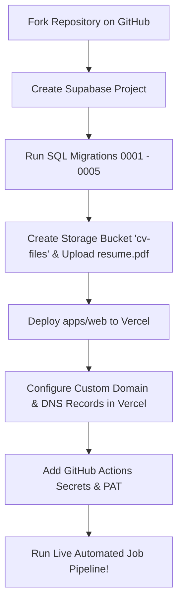

# 🚀 job-me — Automated Job Discovery & Tracking Pipeline

> An open-source, production-ready TypeScript monorepo that automates job discovery, 5-signal match scoring, resume management, and ATS auto-applications for Tech, DevOps, Cloud, Platform, and Software Engineering roles.

---

## 📋 Overview & Core Capabilities

`job-me` is designed as a self-hosted, personal pipeline that takes the manual grind out of job hunting. It continuously monitors RSS feeds and REST APIs for tech roles, scores each posting against your exact skillset using a weighted multi-signal algorithm, and either auto-applies via headless Playwright automation or routes matches to a queue for manual review.

- **Frontend SPA Dashboard**: Vite + React 18 dashboard to view match breakdowns, review queued jobs, manage sources, and update settings.
- **5-Signal Scoring Engine**: Custom fuzzy-matching algorithm evaluating Title, Skills, Seniority, Location, and Recency Decay.
- **Multi-Source Scraping**: Scrapes active RSS feeds and REST APIs with per-source failure isolation and deduplication.
- **ATS Auto-Apply Automation**: Playwright (Chromium) automation for Greenhouse and ATS platforms with configurable rate limiting.
- **Scheduled CI/CD Pipeline**: GitHub Actions cron workflow that downloads your active resume from Supabase Storage and executes scraping every 6 hours.

---

## 🏗 Monorepo Architecture

`job-me` is structured as a TypeScript monorepo managed with `pnpm` workspaces:

```text
job-me/
├── apps/
│   └── web/                   # Vite + React 18 SPA (Dashboard, Summary Bar, Sources, CV, Settings)
├── packages/
│   ├── shared/                # Shared TypeScript types, 5-signal match scoring engine, Supabase client
│   └── scraper/               # Pipeline runner (scrape → match → auto-apply), RSS/API connectors, Playwright ATS
├── supabase/
│   └── migrations/            # Versioned SQL migrations (Schema, RLS policies, fail counters, default sources)
├── .github/
│   └── workflows/
│       └── scrape.yml         # GitHub Actions 6-hour cron & manual pipeline runner with auto CV fetch
├── .env.example               # Central environment variable template reference
├── pnpm-workspace.yaml        # Workspace configuration
└── package.json               # Root scripts for dev, build, typecheck, test, and pipeline execution
```

---

## 🛠 Tech Stack

- **Frontend**: React 18, React Router v6, Lucide React, Vanilla CSS Tokens & Modules.
- **Backend & Database**: Supabase (PostgreSQL, Row Level Security, Supabase Storage).
- **Scraper & Automation**: Node.js, RSS Parser, Playwright (Chromium) for ATS form submission.
- **Hosting & CI/CD**: Vercel (Frontend SPA) + GitHub Actions (Scheduled pipeline runner).
- **Package Management**: `pnpm` workspace monorepo.

---

## ⚡ Local Development Quick Start

### 1. Prerequisites
- **Node.js**: `^20.0.0` or `v24.x`
- **pnpm**: `^9.0.0` (`npm install -g pnpm`)

### 2. Clone Repository & Install Dependencies
```bash
git clone https://github.com/your-username/job-me.git
cd job-me
pnpm install
```

### 3. Configure Local Environment Variables

Create `apps/web/.env`:
```env
VITE_SUPABASE_URL=https://your-project-ref.supabase.co
VITE_SUPABASE_ANON_KEY=your-anon-key-here
VITE_GITHUB_PAT=github_pat_xxxxxx
VITE_GITHUB_REPO=your-username/job-me
```

Create `packages/scraper/.env`:
```env
SUPABASE_URL=https://your-project-ref.supabase.co
SUPABASE_SERVICE_ROLE_KEY=your-service-role-key-here
APPLICANT_FIRST_NAME=Jane
APPLICANT_LAST_NAME=Doe
APPLICANT_EMAIL=jane.doe@example.com
APPLICANT_PHONE=+447123456789
CV_FILE_PATH=/tmp/resume.pdf
```

### 4. Local Execution Commands
```bash
# Start Vite development server (http://localhost:5173)
pnpm dev

# Run TypeScript typecheck across all workspace packages
pnpm typecheck

# Build frontend production bundle
pnpm build

# Execute the Scrape → Match → Auto-Apply pipeline manually via CLI
pnpm pipeline
```

---

## 🌐 Complete Setup Guide: Forking, Supabase, Vercel & Custom Domain

Follow these exact steps to fork this repository and host your own live instance at full scale with a custom domain.



---

### Step 1: Fork & Clone the Repository

1. Click the **Fork** button at the top right of this repository on GitHub.
2. Clone your forked repository to your local machine:
   ```bash
   git clone https://github.com/<your-github-username>/job-me.git
   cd job-me
   ```

---

### Step 2: Supabase Setup (Database & Storage)

1. **Create a Supabase Project**:
   - Log in to [Supabase](https://supabase.com) and create a new project.
   - Note down your project **Reference ID**, **Project URL**, **Anon (public) Key**, and **Service Role (secret) Key** from **Project Settings → API**.

2. **Execute Database Migrations**:
   - Go to **SQL Editor** in your Supabase Dashboard.
   - Run each SQL file in `supabase/migrations/` in order:
     - `0001_init.sql` (Creates core tables: `sources`, `jobs`, `cv_versions`, `applications`, `settings`).
     - `0002_rls.sql` (Enables Row Level Security).
     - `0003_schema_fixes.sql` (Adds `raw_location` and `consecutive_fail_count`).
     - `0004_fix_rls.sql` (Sets up base RLS owner policies).
     - `0005_allow_anon_rls.sql` (Configures permissions for frontend/service role and seeds live job sources).

3. **Configure Storage Bucket**:
   - Go to **Storage** in your Supabase Dashboard.
   - Create a new bucket named `cv-files` (Set to **Private**).
   - Upload your resume PDF file and name it `resume.pdf`.

---

### Step 3: Vercel Deployment & Custom Domain Setup

#### 1. Import Repository into Vercel
1. Log in to [Vercel](https://vercel.com) and click **Add New → Project**.
2. Select your forked `job-me` GitHub repository.

#### 2. Project Configuration
- **Framework Preset**: `Vite`
- **Root Directory**: Click *Edit* and set to `apps/web`
- **Build Command**: `pnpm --filter @job-me/web build`
- **Output Directory**: `dist`
- **Install Command**: `pnpm install`

#### 3. Set Environment Variables in Vercel
Add the following under **Environment Variables**:

| Variable | Value | Notes |
|---|---|---|
| `VITE_SUPABASE_URL` | `https://<your-project-ref>.supabase.co` | Required |
| `VITE_SUPABASE_ANON_KEY` | `<your-supabase-anon-key>` | Required |
| `VITE_GITHUB_PAT` | `github_pat_xxxxxx` | Optional: Enables manual trigger button on `/sources` page |
| `VITE_GITHUB_REPO` | `<your-github-username>/job-me` | Optional: GitHub repository path |

Click **Deploy**.

#### 4. Configure Your Custom Domain in Vercel
1. In your Vercel Project Dashboard, navigate to **Settings → Domains**.
2. Enter your custom domain name (e.g. `jobs.yourdomain.com` or `yourdomain.com`) and click **Add**.
3. Configure the DNS records at your domain registrar (e.g. Cloudflare, Namecheap, GoDaddy):
   - **For Apex Domain (`yourdomain.com`)**:
     - **Record Type**: `A`
     - **Name / Host**: `@`
     - **Value / Target**: `76.76.21.21`
   - **For Subdomain (`jobs.yourdomain.com`)**:
     - **Record Type**: `CNAME`
     - **Name / Host**: `jobs`
     - **Value / Target**: `cname.vercel-dns.com`
4. Vercel will automatically verify DNS propagation and issue a free SSL certificate within a few minutes.

---

### Step 4: Configure GitHub Actions Automation Pipeline

The scraper runs automatically in GitHub Actions every 6 hours via `.github/workflows/scrape.yml`.

#### 1. Set Repository Secrets
In your GitHub repository, go to **Settings → Secrets and variables → Actions** and click **New repository secret**. Add:

| Secret Name | Description / Example Value |
|---|---|
| `SUPABASE_URL` | `https://<your-project-ref>.supabase.co` |
| `SUPABASE_SERVICE_ROLE_KEY` | Your Supabase `service_role` secret key |
| `APPLICANT_FIRST_NAME` | Your first name (e.g. `Jane`) |
| `APPLICANT_LAST_NAME` | Your last name (e.g. `Doe`) |
| `APPLICANT_EMAIL` | Your email address for job submissions |
| `APPLICANT_PHONE` | Your phone number (e.g. `+1234567890`) |

#### 2. Configure Personal Access Token (PAT) for Manual Triggering (Optional)
To trigger scraper runs directly from the web app's `/sources` UI:
1. Go to your GitHub account **Settings → Developer Settings → Personal Access Tokens → Fine-grained tokens**.
2. Generate a token with repository access to your `job-me` fork and permission **Actions: Read and write**.
3. Add this token as `VITE_GITHUB_PAT` in your Vercel project environment variables.

---

### Step 5: Personalization & Running at Full Scale

Once deployed, open your dashboard on your domain and personalize your pipeline:

1. **Configure Target Settings (`/settings`)**:
   - Set target job titles (e.g., `Cloud Engineer`, `DevOps Engineer`, `AWS Instructor`, `Platform Engineer`, `SRE`).
   - Set target seniority level (`junior`, `mid`, `senior`, `any`).
   - Define accepted job locations (`remote`, `uk`, `united states`).
   - Set `Auto-Apply Score Threshold` (default: `0.75`).
   - Add negative keywords (e.g., `clearance required`, `unpaid`, `c2c`).

2. **Manage Job Sources (`/sources`)**:
   - Enable or disable built-in job sources (Remotive, WeWorkRemotely, RemoteOK, NoDesk, HackerNews Jobs, Dev.to).
   - Add new RSS feeds or JSON API endpoints directly from the UI.
   - Use the **Run Pipeline Now** button to execute a scrape on demand.

3. **Manage CVs (`/cv`)**:
   - Upload role-specific CV versions.
   - Tag CVs with target roles so the pipeline selects the right resume during auto-applications.

---

## 🎯 5-Signal Match Scoring Engine

Located in `packages/shared/src/scoring.ts`, `scoreJob()` scores every scraped posting from `0.00` to `1.00` based on 5 weighted signals:

| Signal | Weight | Evaluation Logic |
|---|---|---|
| **Title Match** | **0.40** | Fuzzy token match against configured target roles |
| **Skills Overlap** | **0.30** | Matches key target skills in description text |
| **Seniority Level** | **0.15** | Matches target seniority against title tokens |
| **Location** | **0.10** | Validates raw location against accepted locations |
| **Recency Decay** | **0.05** | Exponential score reduction based on days since posting |

*Note: Jobs containing any negative keyword hit are immediately closed with score forced to `0.00`.*

---

## 🧪 Testing & Code Quality

```bash
# Typecheck all packages
pnpm typecheck

# Build web frontend
pnpm build
```

---

## 📜 License

MIT License — free for personal and commercial adaptation.
